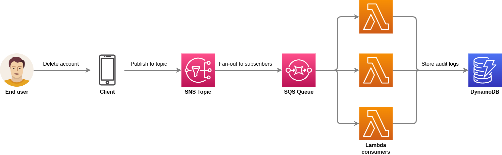

<h1 align="center" style="margin-top:30px">
  Serverless audit solution
</h1>

<p align="center">
This repository has a simple but useful solution to audit events from your applications.
</p>

# 📚 Introduction

In this particular example, the main goal is to store audit logs in DynamoDB whenever an user account is deleted. The main advantage is process these events in background asynchronously, without affecting the end-user experience.

# ✨ Flow

The solution has 5 steps, however, to make things simple, the step 1 (when the user deletes an account) is not implemented. I'll show you how to trigger step 1 later.

1. An user account is deleted
2. The delete event triggers an Lambda that publishes a message to an SNS topic
3. There's an SQS queue subscribed to this SNS topic
4. A Lambda function is triggered from SQS queue
5. The Lambda function consumes the message from SQS and inserts the data in the DynamoDB audit table

To make it even more clear, take a look on the macro-flow below.

<p align="center">

</p>

# 👨🏽‍🔧 Tech stack
- Serverless Framework
- SNS (Simple Notification Service)
- SQS (Simple Queue Service)
- Lambda
- DynamoDB

# 👷 Requirements

- Node.js
- NPM
- Serverless Framework
- An AWS account configured on your machine

# 🗃️ Running the app

1. Clone the repository: ```git clone https://github.com/eduardo3g/serverless-audit-sns-sqs-dynamo.git```
2. Move yourself to the root directory: ```cd serverless-audit-sns-sqs-dynamo```
3. Install the dependencies: ```npm install```
4. Deploy the stack: ```serverless deploy``` or ```npm run deploy```
5. Go to your AWS account and open the ```serverless-audit-dev-deleteAccount``` function
6. Click on the ```Test``` tab and send the test the Lambda with the payload below

```
{
  "email": "john.doe@mail.com"
}
```

# 💡 Results

1. Your test will trigger the ```serverless-audit-dev-deleteAccount``` Lambda function
2. This function will publish a message to the ```DeletedAccountTopic``` SNS topic
3. The SNS topic will push the message to the ```DeletedAccountEventAuditQueue``` SQS queue
4. The ```serverless-audit-dev-recordDeletedAccountInfo``` Lambda will consume this message
5. If the Lambda fails to consume the message 5 times, it'll forward the message to a DQL
6. If it succeeds, a new record will be created in the ```DeletedAccountAuditTable``` DynamoDB table

# 🎉 Contributing

I'm highly opened to contributions and would love to review pull requests to make this project even better.
